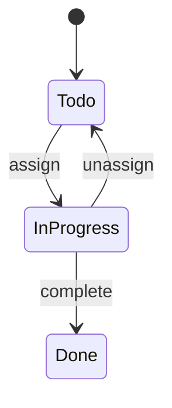

# PR を作成する

## 前提

コードレビューの本質は「バグ発見」ではなく「これは自分たちのプロダクトに組み込むべきか」というチームの判断行為である。
PR作成者の責務は、レビュアーがその判断を下せるだけの文脈を提供すること。
大量の情報で圧倒するのではなく、コードリーディングの助けとなる説明文を書く。

## 目的
- レビュアーの認知負荷を軽減する
  - シンプルで分かりやすい表現を使う
  - 自然な日本語で記述をする
    - 英語スラングを使わない
    - ライブラリ内部の言葉を使わない
  - 長文を避ける
- 実装や変更の意図を正しく伝える（なぜこの変更を行なったのか）
  - 不明点は推測で記述せず、AskUserQuestionでユーザーの意図を確認する

## 文体ルール

- 自然な敬語で、柔らかく簡潔に書く（〜です/ます/しました/お願いします/思います）
- 同じ語尾を連続させない。特に「〜そうです」「〜になります」の繰り返しは機械的に響くので、「〜と思います」「〜です」等に言い換える
- 「〜してしまう」は望ましくない結末専用（「壊してしまう」）。望ましい変更を説明する文脈では「〜にする」と書く
- 事実と推測を区別する。差分から分かる事実に推測形（「〜のようです」「〜そうです」）を使わない。本当に推測のときだけ推測形にする
- 主語をコンポーネント名やファイル名にしない。必ず「ユーザーの体験」や「機能の仕様」を主語にして書く。
- コンポーネント名や技術的な実装手段（ライブラリ名など）は、仕様説明のあとの補足としてカッコ書きやサブ箇条書きに留める
- 内部用語（状態名・enum 値・分岐名・フラグ名・ドメイン固有語）を説明なしに地の文へ出さない。レビュアーがコードベースの語彙を知っている前提を置かない。初出で**概念を普通の言葉で書いて太字**にし、**識別子は（`code`）で添える**（例:「`draft` を地の文に置く」→「**下書き状態**（`draft`）」）
- コード・ファイルパス・コマンドには必ずバッククォートを使用する
- 新規実装を「修正」「刷新」と書かない。AS-IS/TO-BE は正確に区別する
- 簡潔さを最優先。冗長な説明や自明な情報は削る

## 実行手順

### 1. 差分の把握

- `git log` と `git diff` で変更の全体像を把握する
- 変更ファイル数が多い場合は、意味的なまとまりでグループ化して理解する

### 2. 4要素の抽出

すべての差分を読んだ上で、以下の4要素を抽出する。

1. **変更の概要** — ユーザーやシステムにとってどんな機能・仕様を追加/変更したか（コードレベルの差分要約はNG）
2. **設計の意図** — なぜこの構造・アプローチを選んだか
3. **トレードオフの判断** — 何を捨てて何を取ったか。検討した代替案があれば記述
4. **変更の影響範囲** — この変更がどこに波及するか。既存の振る舞いへの影響

4要素すべてが常に必要なわけではない。自明な要素は省略してよい。
例: 単純なtypo修正に「設計の意図」は不要。

### 2.5. 変更内容の構造化

変更が複数の目的にまたがる場合、フラットに並べず**目的別の見出し > 変更リスト**の2段構造にする。
見出しにはディレクトリ名やコンポーネント名を含めず、ユーザーが享受する価値や機能名を書くこと

```
### [目的A — なぜこの変更が必要か]
- 変更1
- 変更2

### [目的B — なぜこの変更が必要か]
- 変更3
```

- 見出しは「なぜこの変更が必要か」がわかる表現にする
- 単一目的のPRならグループ化は不要。フラットなリストで十分

### 2.6. 視覚的な補助（Mermaid / details / Alerts）

GitHub Markdown は限定的な HTML と Mermaid をサポートしている。文章だけで伝わりにくい変更は、以下を**該当時のみ**使ってレビュアーの認知負荷を下げる。乱用は逆効果なので、本当に必要な場面に絞る。

#### Mermaid 図表（` ```mermaid ` の code fence）

以下に該当する変更で**強く推奨**。

- **状態遷移の変更** → `stateDiagram-v2`
- **コンポーネント・モジュール間の依存関係変更** → `graph LR` / `flowchart`
- **API 呼び出し順序・複数システム連携** → `sequenceDiagram`
- **DB スキーマ変更** → `erDiagram`

例:

````markdown

````

#### `<details>` 折りたたみ

長文の **設計の意図** や **トレードオフ** の詳細、検討した代替案、デバッグ過程の補足など。本流だけ読めば理解できる構造にする。

```markdown
<details>
<summary>なぜ Compound Pattern を選んだか</summary>

検討した代替案: …

</details>
```

#### GitHub Alerts

重大な注意点・破壊的変更・移行手順の警告に使う。`> [!NOTE]` `> [!TIP]` `> [!IMPORTANT]` `> [!WARNING]` `> [!CAUTION]` の 5 種。

```markdown
> [!WARNING]
> このマイグレーションは旧カラム `legacy_status` を削除します。デプロイ前にデータ移行スクリプトを実行してください。
```

#### 制約（剥がされるもの）

- `<script>` `<style>` `<iframe>` `<video>` `<audio>` `<object>` `<embed>` は全削除
- JS イベントハンドラ (`onclick` 等) は全削除
- `class` 属性は全削除、`style` 属性も大半削除
- 任意の `<video src>` は不可（GitHub の whitelist 外）。動画は screen-review 経由の GIF 化を使う

### 3. インラインコメントの計画（必須出力）

PR本文を作成する前に、以下の条件に該当する箇所を探し、**必ず「インラインコメント案」としてテキストに書き出す（出力する）こと。**インラインコメントは簡潔に分かりやすく記述すること。
- 差分だけでは意図が読み取りづらい複雑なロジック
- 一見不自然に見えるが理由がある実装（ワークアラウンド、制約回避など）
- レビュアーが「なぜこうしたのか」と疑問に思いそうな判断ポイント
- なるべく1,2行に収めること。冗長な文章は返ってレビュアーの負担が増えます。
- その差分だけを読む人に伝わる**自己完結した内容**にする。削除済みの旧実装・内部ヒューリスティック名・別ファイルの事情など、差分に映らないものを前提にしない（「以前の◯◯をやめた」は旧実装が見えず伝わらない）。「具体的に何が問題で、この変更が何を防ぐ/可能にするか」を書く

**【出力フォーマット】**
（該当箇所がない場合でも、必ず「インラインコメント対象：なし」と出力して思考プロセスを示すこと）
- 対象ファイル: `path/to/file`
- 対象コードの概要と行数の目安: (例: `fetchData` 関数のL50-55付近)
- コメント内容: [なぜこの実装にしたかの意図]

### 4. PR テンプレートの確認

PR作成前に、プロジェクトのPRテンプレートを確認する。

```bash
# GitHub標準のテンプレート配置場所を確認
ls .github/pull_request_template.md .github/PULL_REQUEST_TEMPLATE.md .github/PULL_REQUEST_TEMPLATE/ pull_request_template.md 2>/dev/null
```

#### テンプレートが存在する場合

- テンプレートの構造に従って記述する
- テンプレートに以下の要素が不足している場合、適切な箇所に補足する
  - **設計の意図**: なぜこのアプローチを選んだか
  - **トレードオフの判断**: 何を捨てて何を取ったか
  - **変更の影響範囲**: どこに波及するか
  - **確認してほしいポイント**: レビュアーに判断を仰ぎたい箇所
- テンプレートの項目に該当がない場合は空欄にせず、項目ごと削除する

#### テンプレートが存在しない場合

以下のフォールバックフォーマットを使用する。

```
## チケット・仕様書
- チケット: [チケットURL（該当がある場合）]
- 仕様書: [対応する仕様書のパス（該当がある場合）。例: `docs/design/db-schema.md`]

## 概要
[この PR の目的を1-3文で。「何を実現するか」をユーザー/システム視点で記述]

## 変更内容
[具体的な変更のリスト。複数の目的がある場合は2段構造で記述]

### [目的A — なぜこの変更が必要か]
- 変更1
- 変更2

### [目的B — なぜこの変更が必要か]
- 変更3

## 設計の意図
[なぜこのアプローチを選んだか]

## トレードオフ
[何を捨てて何を取ったか。代替案があれば]

## 影響範囲
[波及する箇所。既存動作への影響]

## 確認してほしいポイント
[レビュアーに特に判断を仰ぎたい箇所]
```

#### 共通ルール

- 「概要」に相当するセクションは必須
- 内容がないセクションは作らない。単純な変更なら概要だけで十分
- テンプレートの形式を尊重しつつ、レビュアーの判断を助ける情報を過不足なく盛り込む

### 4.5. 動作確認項目の前提（再現条件）を明記する

動作確認・確認項目を書くときは、その確認を**再現するための前提**を必ず添える。前提が抜けると、レビュアーは確認手段が分からず手戻りになる。

- 対の PR / 別リポ / 別ブランチを同時に動かす必要があるか（例: モバイルとWeb、フロントとバックエンド）
- 特定の環境変数・フィーチャーフラグ・seed データが必要か
- 起動が必要なサービス、または接続先（どの URL / ポートを指すか）
- マイグレーションやデプロイの順序指定

特に**複数のリポ/PRが揃って初めて動く変更**は、片方の PR しか見ないレビュアーが必ずいる前提で、関係する各 PR に前提を書く（`> [!IMPORTANT]` が有効）。対の PR・接続先は実コードで裏取りしてから書く（憶測で書かない）。

### 5. PR 作成

- `gh pr create` で PR を作成する。
- 自分を Assignees に設定する

### 6. screen-review 連携（UI 変更がある場合）

UI に影響する PR では、修正前後のスクリーンショットと動作確認 GIF を本文に自動添付する。レビュアーが「実装結果を画面で見て判断する」ための情報源になる。

#### このステップが必要かの判定

以下のいずれかに該当すれば実行対象。

- `git diff --name-only` でフロントエンドのコード（`*.tsx` / `*.jsx` / `*.vue` / `*.svelte` / `*.css` 等）や画像などの静的アセットに変更がある
- ユーザー目線で見た目や挙動が変わる（既存ボタンの位置変更、新規モーダル、アニメーション追加 等）

該当しない場合（バックエンドのみ、テスト追加のみ、リファクタで挙動不変）はスキップ。
screen-review スキルが導入されていない環境でもスキップし、スクリーンショットを添付できない旨をユーザーに伝える。

#### 素材がない場合

素材がまだ無ければ、screen-review スキルを発動し、そのディレクトリ規約・ファイル命名規約（修正前/修正後ペア、単発、動画の使い分けを含む）に従って素材を揃えてから戻る。規約はここに転記せず、常に screen-review 側を正とする。

#### 実行

screen-review スキルの「PR 添付フロー」に従い、screen-review スキルのディレクトリにある `scripts/publish-pr.sh` を実行する。

```bash
<screen-review スキルのディレクトリ>/scripts/publish-pr.sh /tmp/claude-shots/<TOPIC>
```

- PR 番号は現ブランチから自動取得
- 本文末尾にマーカーで囲まれたブロックが差し込まれる
- 何度実行しても重複しない（既存ブロックを差し替える）
- マージ後の清掃は不要（画像は GitHub の user-attachments に保持され、リポジトリを汚さない）

### 7. インラインコメントの投稿

手順3で作成したインラインコメント案が存在する場合、必ず `gh api` を実行してPRにコメントを投稿する。

**【行番号特定のコツ】**
- 投稿前に必要であれば対象ファイルの実際のコードを確認し、正しい `start_line` と `line` を特定してからAPIを実行すること。
- 対象は1行ではなく、意味的なまとまり（関数定義、ロジックブロックなど）を範囲指定する（推奨）。

#### 複数行の範囲を指定する場合

```bash
gh api repos/{owner}/{repo}/pulls/{pr_number}/comments \
  --method POST \
  -f body="コメント内容" \
  -f commit_id="$(git rev-parse HEAD)" \
  -f path="対象ファイルパス" \
  -F start_line=開始行番号 \
  -F line=終了行番号 \
  -f start_side="RIGHT" \
  -f side="RIGHT"
```

#### 1行のみの場合

```bash
gh api repos/{owner}/{repo}/pulls/{pr_number}/comments \
  --method POST \
  -f body="コメント内容" \
  -f commit_id="$(git rev-parse HEAD)" \
  -f path="対象ファイルパス" \
  -F line=行番号 \
  -f side="RIGHT"
```

#### 範囲指定のルール

- コメント対象のコードが差分上で何行にわたるか確認し、`start_line` と `line` で範囲を指定する
- 関数全体、条件分岐ブロック、設定オブジェクトなど、意味的なまとまりを範囲にする
- 1行だけが対象の場合のみ `start_line` を省略する

## 注意事項

- PRタイトルは30文字以内でprefixをつけない
- issue との紐付けがある場合は `Closes #123` を概要に含める
- 別リポや対になる PR を参照するときは `#NN` ショートハンドでなく**フル URL**を使う（別リポでは同番号の別 PR に誤リンクする）
- レビュアーの時間は有限。「読めばわかること」は書かない
